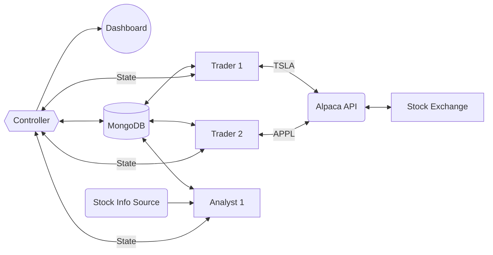

# rusty-trader

## Usage

Docker Compose:

- Use latest image from packages: <https://github.com/fubblea/rusty-trader/pkgs/container/rusty-trader>
- Get Alpaca keys from here: <https://app.alpaca.markets/brokerage/new-account>
- See `docker-compose.yml` for example

## Architecture

Controller controls the traders and analysts through state messages. The traders and analysts are implemented as separate processes and can be scaled independently while the controller is a singleton process.

Each trader watches one stock and implements the strategy requested by the controller. Each analysts will monitor a source of stock information and recommend stocks and a strategy to the controller.

Any information that cannot be shared through a state message will be stored in a database. The state message will a pointer to the information in the database. The controller also updates the dashboard with the latest information from the database.